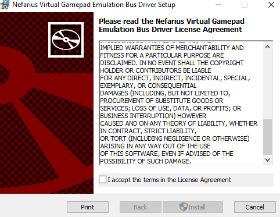

# Requirements
* Windows
* Python : >= 3.7
* Trackmania 2020 or trackmania Forever
* A recent NVIDIA GPU (this is required only if you plan to train your own AI)

# Installation

1. Clone the `tmrl` repository.
```shell
git clone https://github.com/yannbouteiller/tmrl.git
cd tmrl
```
2. Create a conda environment.
```shell
conda create -n tmrl python=3.8
conda activate tmrl
```

2. Install the library **using the `-e` option** (for now, the project will not work if you omit this option).
```shell
pip install -e .
```
During the installation, a driver will be installed to emulate a virtual gamepad in order to control the game.
Accept the licence agreement and install the driver when prompted.



## Trackmania 2020

### Install Trackmania 2020
To install the free version of TM20, you can follow the instructions on the [official website](https://www.trackmania.com/) .

### Install Openplanet


If you want to run the self-driving-car on Trackmania 2020, you will need to install 
[Openplanet for trackmania](https://openplanet.nl/).

Make sure that you have the Visual C++ x64 runtime installed or OpenPlanet will not work. You can download it [here](https://aka.ms/vs/16/release/vc_redist.x64.exe).

After that, copy the folder `Scripts` and paste it in `C:\Users\username\OpenplanetNext\`.

Launch Trackmania 2020 game.

To check that everything works, lauch a track, then press `f3` to open the Openplanet menu, open the logs by clicking `OpenPlanet > Log`, and in the OpePlanet menu click `Developer > Reload plugin > TMRL grab data`. You should see a message like "waiting for incomming connection" appear in the logs.
Then press `f3` again to close the menu.
