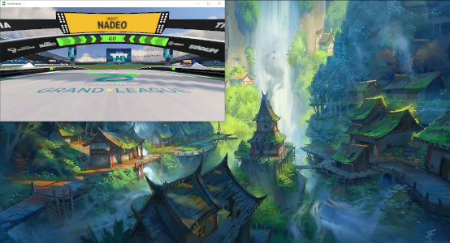

# Getting started with TMRL

Before reading these instructions, make sure you have installed TMRL and OpenPlanet correctly as described [here](docs/Install.md).

In this document you can learn:
- How to test a pre-trained self-driving car in TrackMania 2020.
- How to train your own AIs on any track (caution: the track cannot have weird triggered events such as GPS replays).
- How to use the API in other games or applications.


## Demo of a pre-trained AI

Please follow/adapt these steps so that your TrackMania game works with TMRL:

- Launch TrackMania 2020
- In case the OpenPlanet menu is showing in the top part of the screen, hide it using the F3 key
- Set the game in windowed mode. To do this, bring the cursor to the top of the screen and a drop-down menu will show. Hit the windowed icon.
- Bring the TrackMania window to the top-left corner of the screen. On Windows10, it should automatically fit to a quarter of the screen.
- In the drop-down menu, hit the `Settings` icon
- In the `Graphics` tab, ensure that the resolution is 958 (width) * 488 (height) pixels.
- In the `Input` tab, select `keyboard` in `edit device`. For `Give up`, set the `Enter` key (you may remap the chat key to something else).
- In the `Interface` tab, set `player visibility for cockpit view` to `old`.
- Close the `Settings` menu.
- In the lobby, select `Training` and select track number 1.
- Enter the cockpit view by hitting the `3` key.
- Hide the ghost by pressing the `g` key.

The trackmania window should now look like this:



- Open a terminal and put it where it does not overlap with the trackmania window.
For instance in the bottom-left corner of the screen.
- Activate the python environment in which `tmrl` is installed.
- cd to your `tmrl` repository.
- Run the following command, and directly click somewhere in the TrackMania window so that the script can control the car.
```shell
python tmrl/run.py --test
```

You should now see the car drive autonomously.

(TODO: gif)


## Train your own self-driving AIs

Please follow/adapt these steps so that your TrackMania game works with TMRL:

before starting a training session, make sure the pretrained AI works

- select a track you want to train on, the track has to contain only road with no jump
- Open 3 terminals and put it where it does not overlap with the trackmania window.
For instance in the bottom-left/bottom-right/top-right corner of the screen.
- Activate the python environment in which `tmrl` is installed.
- cd to your `tmrl` repository.
- Run the following commands on the three different terminal, then directly click somewhere in the TrackMania window so that the script can control the car.
```shell
python tmrl/run.py --server
python tmrl/run.py --trainer
python tmrl/run.py --worker
```

when it is training, make sure that you don't see any timestep in the worker treminal
Now we will see how to train our own car with the track you want

it should take approximatively 5 hours for the car to understand how to take a turn correctly

## Use the TMRL API in other applications

Work in progress


